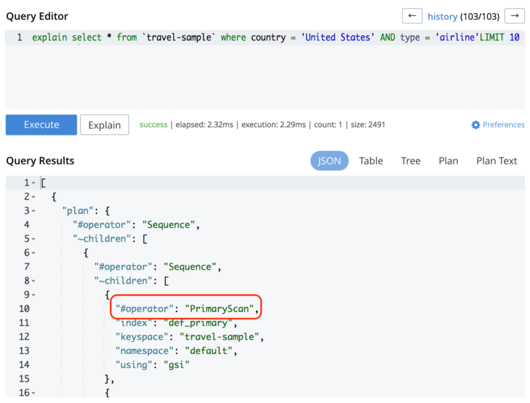

title: Couchbase in 5 minutes
author:
    name: "Thomas Queste"
    url: "tomsquest.com"
    email: "tom@tomsquest.com"
    twitter: "@ThomasQueste"
output: index.html
style: index.css 
controls: false
--
# Couchbase in 5 minutes


-- 
### Size

* Key (doc id) = ?
* Value (doc) = ?

-- 
### Size

* Key (doc id) = 250 bytes or 250 utf-8 chars
* Value (doc) = ?

-- 
### Size

* Key (doc id) = 250 bytes or 250 utf-8 chars
* Value (doc) = between 5 and 20 Mo (utf-8)

--
### Buckets

--
### Buckets

Each bucket defines its Replication, Caching...

Buckets are, in fact, the Data service

--
### Services

1. Data: K/V, Replication, Aggregation View
1. Query: N1QL, Query planner
1. Index
1. Search
1. Cluster Manager
1. Eventing (5.5, summer 2018)
1. Analytics (6.x, late 2018)

--
### Running a N1QL query

App(N1QL) -> Query -> Index (-> Data )

--
### Covering Index

Covering Index: index containing all the requested values

`SELECT name FROM data WHERE email='foo@bar.com'`

`CREATE INDEX emailIdx ON data(email,name)`
  
--
### Primary index

Recommendation(Couchbase): delete the primary index in production

--
### Primary index

Contains all the document IDs in the database (+ meta)

Used when no other index can be used.

Get an ID, load the doc from the Data service, one by one.

Tips: deleting the primary index force to use indexes (a query is KO if it can't use an index)

--
### Primary scan



--
### Indexes

Index on `field1, field2` is not an index on `field2, field1` (like anywhere).

--
### Indexes

**No index usage: `WHERE 'foo' IN genres`**

Solution: 

`WHERE ANY genre IN genresIdx SATIFIES genre='foo' END`

`CREATE INDEX ON data (DISTINCT ARRAY genresIdx FOR genre IN genres END);`

--
### Indexes

Attributes are case-sensitive.

--
### XDCR

Can be unidirectional, bidirectional, hybrid

bidirectional = unidirectional x 2

--
### Single connection

Tips: one connection per process (node.js)

> One of the more resource-consuming processes that you can perform with the SDKs.
  
> When you create a new connection, Couchbase Server needs to provide current server topology to the client instance (+authentication). Because this is the case, you want to try to reduce the number of times you need to create a connection and attempt to reuse existing connections. 

--
### Cluster Map

Problem: How I know the node is down?

--
### Cluster Map

The client (SDK) **knows** the topology with the ClusterMap.

`getFromReplica` when a node is down

The load balancer is _us_ and not a _master_

--
### couchbase://

Controls how the client attempts to retrieve the configuration from the cluster

"normal bootstrap process": data port (=memcached), then http bootstrap/Rest API port

-- 
### Paginate

Problem: Offset does not "skip" (time increase with the size)

Solution 1: Use Couchbase 5.x

Solution 2: Use `startkey_docid`

```
Query for page 1: ?limit=5
Query for page 2: ?limit=5&startkey_docid=docIdFromPreviousPage&skip=1

```

--
### CAS, "Check And Set"

= "compare and swap"

Documents cannot be replace without their most current CAS

--
### CAS, "Check And Set"

= "compare and swap"

Documents cannot be replace without their most current CAS

A Timeout does not mean the operation failed. 
So if the CAS fails when **retrying**, this means the operation succeeded!

